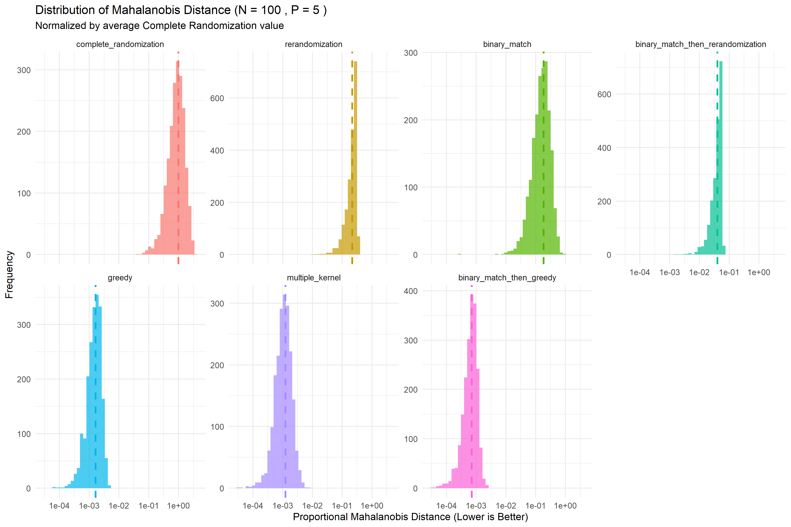

# GreedyExperimentalDesign

An R package for computing near optimal experimental designs for a two-arm experiment with covariates. This is joint work with Abba M. Krieger of the Wharton School of the University of Pennsylvania and David Azriel of The Technion.

To load the package, make sure `rJava` is installed and properly configured! Then:

	options(java.parameters = "-Xmx10g") # or however much memory you wish to allocate
	# For GPU-enabled machines, we recommend the following to remove warnings:
	# options(java.parameters = c("-Xmx10g", "--enable-native-access=ALL-UNNAMED"))
	library(GreedyExperimentalDesign)
	
If you want to use the numerical optimization design, download [https://www.gurobi.com/downloads/gurobi-software/](Gurobi) and register your machine with your license via `grbgetkey`. Then, this download comes with its own proprietary R package and you need to do a local install via `R CMD INSTALL`.

## GPU Acceleration (Optional)

The package can offload kernel matrix computation, objective evaluation, and the full greedy search to a GPU via [wgpu-native](https://github.com/gfx-rs/wgpu-native), a cross-platform WebGPU implementation. GPU acceleration is entirely optional — the package works without it on all platforms, falling back to optimized CPU routines automatically.

**Supported hardware:** any GPU recognized by WebGPU — NVIDIA (Vulkan/D3D12), AMD (Vulkan/D3D12), Intel (Vulkan/D3D12), and Apple Silicon / AMD (Metal). The benefit is largest for kernel searches on large sample sizes (n ≥ 500, p ≥ 8).

### How it works

During `R CMD INSTALL`, the `configure` / `configure.win` script looks for wgpu-native at `<repo-root>/lib/wgpu/`. When found it compiles the GPU backend into the package (`-DGED_USE_WGPU`) and links against it. When not found the package compiles normally with CPU-only code — no error, no warning.

The expected directory layout (relative to the repository root):

```
GreedyExperimentalDesign/        ← git repository root
├── lib/
│   └── wgpu/                    ← extract wgpu-native release here
│       ├── include/
│       │   └── webgpu/
│       │       ├── webgpu.h
│       │       └── wgpu.h
│       └── lib/
│           └── <platform library>
└── GreedyExperimentalDesign/    ← R package source (configure lives here)
```

### Linux setup

**Requirements:** Vulkan-capable GPU with up-to-date drivers (`vulkan-loader` + vendor driver).

1. Download the latest wgpu-native Linux x86-64 release from the [wgpu-native releases page](https://github.com/gfx-rs/wgpu-native/releases). Look for the asset named `wgpu-linux-x86_64-release.zip` (version ≥ 0.19.0).

2. Extract into the repository:

    ```bash
    cd /path/to/GreedyExperimentalDesign   # repo root
    mkdir -p lib/wgpu
    unzip ~/Downloads/wgpu-linux-x86_64-release.zip -d lib/wgpu
    ```

    Verify the layout:
    ```
    lib/wgpu/include/webgpu/webgpu.h
    lib/wgpu/lib/libwgpu_native.so
    ```

3. Install the package:

    ```bash
    R CMD INSTALL GreedyExperimentalDesign
    ```

    You should see `configure: wgpu-native found in ../lib/wgpu` during the build.

4. Verify from R:

    ```r
    library(GreedyExperimentalDesign)
    ged_gpu_available()   # TRUE, with wgpu_compiled = TRUE
    ged_gpu_devices()     # data frame listing the detected GPU
    ```

**Runtime note:** `libwgpu_native.so` is embedded in the build via `-rpath`, so no extra `LD_LIBRARY_PATH` configuration is needed after a standard install.

---

### macOS setup

**Requirements:** Apple Silicon (M1/M2/M3/M4) or Intel Mac with AMD/Intel GPU; macOS 13 Ventura or later recommended for best Metal support.

1. Download `wgpu-macos-aarch64-release.zip` (Apple Silicon) or `wgpu-macos-x86_64-release.zip` (Intel) from the [wgpu-native releases page](https://github.com/gfx-rs/wgpu-native/releases) (version ≥ 0.19.0).

2. Extract into the repository:

    ```bash
    cd /path/to/GreedyExperimentalDesign   # repo root
    mkdir -p lib/wgpu
    unzip ~/Downloads/wgpu-macos-aarch64-release.zip -d lib/wgpu
    ```

    Verify the layout:
    ```
    lib/wgpu/include/webgpu/webgpu.h
    lib/wgpu/lib/libwgpu_native.dylib
    ```

3. Install the package:

    ```bash
    R CMD INSTALL GreedyExperimentalDesign
    ```

4. On macOS, the dynamic linker may quarantine downloaded `.dylib` files. If the package loads but `ged_gpu_available()` returns `FALSE`, clear the quarantine flag:

    ```bash
    xattr -d com.apple.quarantine lib/wgpu/lib/libwgpu_native.dylib
    ```

    Then reinstall.

5. Verify from R:

    ```r
    library(GreedyExperimentalDesign)
    ged_gpu_available()
    ged_gpu_devices()
    ```

---

### Windows setup

**Requirements:** DirectX 12–capable GPU (any modern NVIDIA, AMD, or Intel GPU on Windows 10/11) with up-to-date drivers. Rtools 4.4 or later is required to build the package from source.

1. Download `wgpu-windows-x86_64-gnu-release.zip` from the [wgpu-native releases page](https://github.com/gfx-rs/wgpu-native/releases) and click 'Show all xx assets' (version ≥ 0.19.0). **Use the `-gnu-` variant**, not `-msvc-`: R on Windows uses Rtools (MinGW/GCC) and requires the GNU import library (`libwgpu_native.a`); the MSVC releases ship only `wgpu_native.lib` which the MinGW linker cannot use.

2. Extract into the repository:

    ```
    GreedyExperimentalDesign\   ← repo root
    └── lib\
        └── wgpu\
            ├── include\
            │   └── webgpu\
            │       ├── webgpu.h
            │       └── wgpu.h
            └── lib\
                ├── wgpu_native.dll
                └── libwgpu_native.a   ← MinGW import library included in the -gnu- release
    ```

3. Install the package (from an Rtools-aware shell or RStudio terminal):

    ```bash
    R CMD INSTALL GreedyExperimentalDesign
    ```

    You should see `configure.win: wgpu-native found in ../lib/wgpu` during the build.

4. Make `wgpu_native.dll` findable at runtime by adding its directory to `PATH` before starting R:

    ```powershell
    $env:PATH = "C:\path\to\GreedyExperimentalDesign\lib\wgpu\lib;" + $env:PATH
    Rscript -e "library(GreedyExperimentalDesign); ged_gpu_available()"
    ```

    Alternatively, copy `wgpu_native.dll` into the installed package's library path (e.g. `C:\Users\you\AppData\Local\R\win-library\4.4\GreedyExperimentalDesign\libs\x64\`).

5. Verify from R:

    ```r
    library(GreedyExperimentalDesign)
    ged_gpu_available()
    ged_gpu_devices()
    ```

---

### Usage

Once GPU support is compiled in, the package uses it automatically. The startup option `GreedyExperimentalDesign.use_gpu` is set to `TRUE` on load when a GPU is detected, and functions that accept a `backend` parameter default to `"auto"` which routes to the GPU.

Note: on GPU-enabled machines, it is recommended to set `options(java.parameters = c("-Xmx10g", "--enable-native-access=ALL-UNNAMED"))` before loading the library to allocate enough memory and suppress JVM "illegal-access" warnings.

```r
library(GreedyExperimentalDesign)
```
# Check what is available
ged_gpu_available()
ged_gpu_devices()

# Compute a distance matrix (routes to GPU automatically when available)
X = matrix(rnorm(1000 * 10), nrow = 1000)
D = compute_distance_matrix_gpu(X)                     # backend = "auto"
D = compute_distance_matrix_gpu(X, backend = "cpu")    # force CPU
D = compute_distance_matrix_gpu(X, backend = "gpu")    # force GPU

# Compute a kernel matrix
K = compute_kernel_matrix_gpu(X, kernel = "gaussian", gamma = 0.5)
K = compute_kernel_matrix_gpu(X, kernel = "laplacian", gamma = 1.0)
K = compute_kernel_matrix_gpu(X, kernel = "poly", poly_s = 3L, gamma = 1.0)

# Evaluate kernel objective across many candidate designs
r = 500
W = matrix(sample(c(-1, 1), r * nrow(X), replace = TRUE), nrow = r)
obj_vals = compute_objective_vals_gpu(W, K)    # length-r vector

# Run a full greedy search entirely on the GPU (no per-iteration CPU round-trip)
Sinv = solve(cov(X))
start_w = c(rep(1L, 500), rep(0L, 500))
best_w = full_greedy_search_gpu(X, Sinv, start_w, max_iters = 1000)
```

To disable GPU use without reinstalling:

```r
options(GreedyExperimentalDesign.use_gpu = FALSE)
```

To run the GPU vs CPU benchmark included in the package:

```bash
Rscript GreedyExperimentalDesign/benchmarks/benchmark_gpu_backend.R 2048 16 64
# args: n p r  (sample size, covariates, candidate designs)
```

## Manual cleanup before install

If `R CMD INSTALL GreedyExperimentalDesign` fails with architecture mismatch errors (for example, "not a valid Win32 application"), remove stale compiled artifacts in the package `src/` directory and reinstall.

On macOS/Linux (from `GreedyExperimentalDesign/`):

```
rm -f src/*.o src/*.so src/*.dll src/*.dylib
```

On Windows (from `GreedyExperimentalDesign\`):

```
del /Q src\\*.o src\\*.so src\\*.dll src\\*.dylib
```

## Mahalanobis benchmark

The following benchmark demonstrates this package's many designs. It draws a fixed covariate matrix and plots the distribution of Mahalanobis distances for the candidate designs each method returns. Lower proportional Mahalanobis distance means better balance, so methods whose histograms are shifted further left tend to produce better-balanced designs on this dataset. The vertical lines show each method's average proportional Mahalanobis distance. Complete randomization provides a baseline; methods that concentrate mass well to the left of that baseline are producing stronger balance improvements under the same objective.



To generate the figure above, run:

	Rscript GreedyExperimentalDesign/benchmarks/plot_obj_value_comparison_all_searches.R
